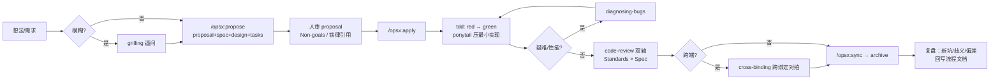

# NetWave 开发流程

> 本文档固化 netwave 每个模块的开发循环。哲学：**上"约束"（磁盘上的铁律 + 先红后绿），
> 不上"脚手架"（多智能体编排、CLI 状态机）**。强模型够用，但补它三个结构性短板：
> 跨会话失忆、会跳测试、无法自证浮点正确。
>
> 铁律见[项目宪法](constitution.md)，测试细节见[测试规划](测试规划.md)，功能范围见[功能覆盖规划](功能覆盖规划.md)。

## 核心循环：grill → spec → red → green → review → 复盘

每个核心模块（Touchstone / Network / Circuit / Frequency 及其子功能）走同一个六步循环：

```text
┌─ grill ──► spec ──► red ──► green ──► review ──► 复盘 ─┐
│  逼问需求   写契约   写失败   最小实现   两轴审查   回写流程 │
│                              测试                       │
└──────────────────────────────────────────────────────────┘
         发现设计错了？回到 spec / grill
```

### grill —— 动手前逼问需求（防"做错东西"）

- 用 `grilling` skill 把模糊点逼出来：端口范围？复数 z0 要不要支持？边界情况？性能目标？
- 产出：把关键决策写进当前变更文件夹的 `proposal.md` / `design.md`（见下
  [spec —— 写可测试契约](#spec--写可测试契约防做歪)），或 `Plan/` 下一段 ADR。
- **不写代码。** 这一步只对齐"做什么、为什么"。

### spec —— 写可测试契约（防"做歪"）

- 一个模块 = 一个 OpenSpec 变更（CLI 已装，`/opsx:propose` 一步生成全部工件）：

  ```text
  openspec/changes/<change-id>/
    proposal.md   # 为什么、改什么（必须含 Non-goals 段）
    specs/…       # 可测试需求 + 每条的容差（引用 manifest key）+ 边界
    design.md     # 交错复数布局、算法选型（照搬 skrf 哪个函数）
    tasks.md      # 实现清单，每项可验证；数值任务前必有 red 测试条目
  ```

- `openspec/config.yaml` 的 context/rules 会自动注入每次 `/opsx:*` 操作
  （指向[项目宪法](constitution.md)这个唯一真相源，另加 proposal/spec/tasks 专属规则）。
- spec 里每条需求必须**可测**：写成"给定 X 输入，S→Z 输出与 skrf golden 误差 < 1e-12"这种。
- 需求含糊到会影响范围时，最多标 3 个 `[NEEDS CLARIFICATION]`，其余做合理默认。
- 实施完成后 `/opsx:sync` 同步 delta spec 到主 spec，`/opsx:archive` 归档变更。

### red —— 先写失败测试（[铁律二](constitution.md#铁律二数值-api-无失败测试不许写实现tdd-铁律)）

- 在写实现**之前**，先写测试并**运行看到它失败**：
  - golden：`gen_golden.py` 用 skrf 生成期望 → 写断言读 [manifest](测试规划.md#manifestjson-契约) + golden 比对。
  - unit 解析自校验：λ/4 变换器、往返恒等等闭式解。
  - property proptest：随机 Network 的不变量。
- 期望值来自独立真值（skrf / 教科书 / 物理不变量），**绝不用被测代码算**。
- 测试没跑红过 = 不知道它测的对不对 = 不算数。

### green —— 最小实现让测试通过

- 只写让当前测试通过的最小代码，不anticipate 未来需求、不顺手加没测的功能。
- 一次一个 vertical slice：一个测试 → 一段实现 → 重复。不"先写完所有测试再写完所有实现"。
- 照搬 skrf 已验证算法，不重新发明（见[功能覆盖规划](功能覆盖规划.md)）。

### review —— 提交前两轴审查（防"腐化"）

- 用 `code-review` skill 做两轴并行审查：
  - **Standards 轴**：是否合[项目宪法](constitution.md)七条铁律？有无 Fowler 坏味道（尤其 Speculative Generality——Rust 里过度造轮子）？
  - **Spec 轴**：是否忠实实现了 spec.md？有无多做/少做？
- 跨端改动额外跑 cross-binding 跨绑定对拍（core/python/node 同输入 bit 级一致，wasm 用相对容差）。
- CI 全绿（clippy -D warnings、fmt、criterion 无劣化）才允许合并。

### 复盘 —— 归档时回写流程文档（防"流程腐化"）

每个变更 `/opsx:archive` 时顺手回答三问，无则跳过、不空写：

1. **工具/skill 有无新坑、命令变更、版本漂移？** → 回写本文档技能地图，
   或本机 `~/GitHub/knowledge/工具升级指南.md` 对应节（如 OpenSpec CLI 升版后同步版本号；该库在仓库外，不建链接）。
2. **constitution / 本文档有无歧义或更优模式？** → 直接修订对应位置。
3. **容差 / 测试实践与[测试规划](测试规划.md)是否出现偏差？** → 同步修订。

原则同 knowledge 各升级指南：确认的建议直接改文档，保持文档与实践一致，
不单独维护问题清单。

## 何时可以简化

| 场景                       | 简化                                                                                  |
| -------------------------- | ------------------------------------------------------------------------------------- |
| 改文档 / 注释 / 常量       | 跳过 red/green，直接改 + review                                                       |
| 修 bug                     | 走完整循环，但 red 步 = 先写一个复现该 bug 的失败测试（diagnosing-bugs 先建反馈回路） |
| 一次性原型 / 探索          | 允许 throwaway，不写测试，但**代码不进主干**，结论回写 spec                           |
| 纯绑定胶水（无新数值逻辑） | 跳过 unit/property，保留 cross-binding 对拍                                           |

## 技能地图（已就位工具 × 使用阶段）

> 工具链均已安装完毕。**进入编码的唯一硬前置仍是构建链**（`cargo` / `maturin` / `napi`，
> 即阶段 0 脚手架本身）；下列工具是流程装备，不是开工条件。

### 工具链状态

| 工具                                                                                                                        | 状态    | 安装/位置                                                                                                                                                                                                                                                                                                               |
| --------------------------------------------------------------------------------------------------------------------------- | ------- | ----------------------------------------------------------------------------------------------------------------------------------------------------------------------------------------------------------------------------------------------------------------------------------------------------------------------- |
| Harness skills（tdd / code-review / diagnosing-bugs / grilling / codebase-design / domain-modeling / prototype / research） | ✅ 已装 | `knowledge/Harness/skills` submodule，经 `link-skills.sh` symlink 到 `~/.claude/skills/`，submodule 更新自动生效                                                                                                                                                                                                        |
| Ponytail（极简模式）                                                                                                        | ✅ 已装 | `~/.claude/skills/ponytail*`，anti-over-engineering                                                                                                                                                                                                                                                                     |
| OpenSpec CLI v1.13.1                                                                                                        | ✅ 已装 | npm 全局 + 本仓库 `openspec/`；CLI 升级后需在每个已初始化项目里跑 `openspec update`（详见本机 `~/GitHub/knowledge/工具升级指南.md` OpenSpec 节，仓库外不建链接）                                                                                                                                                        |
| pnpm 12.5.1                                                                                                                 | ✅ 已装 | nvm（node v26.4.0）下经 corepack 管理（`corepack enable` + `corepack prepare pnpm@<钉死版本> --activate`）。注意：corepack shim 首次运行会下载对应版本二进制并**交互式确认**，无人值守终端会假死——根 `package.json` 钉死 `"packageManager": "pnpm@<版本>"` 后自动确定版本，或临时设 `COREPACK_ENABLE_DOWNLOAD_PROMPT=0` |
| uv 0.12.13                                                                                                                  | ✅ 已装 | 独立安装（非 pip），Python 环境管理见[总体计划·Python 环境管理](总体计划.md#python-环境管理uv)                                                                                                                                                                                                                          |
| Rust 工具链（rustup 1.98.1）                                                                                                | ✅ 已装 | `~/.cargo/bin/`（rustup 管理）；已加 target `wasm32-unknown-unknown`。新终端靠 `~/.bashrc` 的 `. "$HOME/.cargo/env"` 生效，PATH 未更新时先 Reload Window                                                                                                                                                                |
| wasm-pack 0.15.0                                                                                                            | ✅ 已装 | `~/.cargo/bin/wasm-pack`（cargo install）                                                                                                                                                                                                                                                                               |
| cargo-zigbuild 0.23.4 + zig 0.16.0                                                                                          | ✅ 已装 | zig 为官方 aarch64 tarball 解到 `~/.local/zig`，软链 `~/.local/bin/zig`（本机无 brew；apt 需 root，免 root 用 tarball）。发版交叉编译用，本地开发非必需                                                                                                                                                                 |
| cargo-llvm-cov                                                                                                              | ✅ 已装 | `~/.cargo/bin/cargo-llvm-cov`（cargo install）；覆盖率用 `cargo llvm-cov`，全端底线 100% 行覆盖、豁免须逐条标注（见[测试规划·覆盖率与工具](测试规划.md#覆盖率与工具)）                                                                                                                                                  |
| RF 术语路由                                                                                                                 | ✅ 已建 | `~/GitHub/knowledge/RF/` 下两本书各自的 SKILL.md + 术语表.md（编写期查定义用，代码/文档正文必须自包含）                                                                                                                                                                                                                 |

### 阶段 × 技能

| 阶段        | 技能 / 命令                          | 什么时候用                                                                                                             |
| ----------- | ------------------------------------ | ---------------------------------------------------------------------------------------------------------------------- |
| 需求模糊    | `grilling`                           | 端口范围、复数 z0、边界情况没定清时，先逼问再立项                                                                      |
| 立项        | `/opsx:propose`                      | 生成 `openspec/changes/<id>/` 全套工件（proposal/spec/design/tasks）                                                   |
| API 设计    | `codebase-design`、`domain-modeling` | 定 crate 边界、deep module 接口、术语命名（对齐权威术语表）                                                            |
| 实施        | `tdd` + `ponytail`                   | red→green 循环（[铁律二](constitution.md#铁律二数值-api-无失败测试不许写实现tdd-铁律)）；ponytail 防过度设计，最小实现 |
| 疑难 / 性能 | `diagnosing-bugs`                    | bug 复现回路、性能劣化排查（先建反馈回路再动手）                                                                       |
| 探索        | `prototype`                          | throwaway 原型验证算法/布局直觉，代码不进主干                                                                          |
| 调研        | `research`                           | 查 skrf 行为、Touchstone 规范等一手资料并落盘                                                                          |
| 审查        | `code-review`                        | 提交前双轴：Standards（[七铁律](constitution.md)＋坏味道）× Spec（忠实度）                                             |
| 收尾        | `/opsx:sync` → `/opsx:archive`       | delta spec 并入主 spec，变更归档                                                                                       |

### 流程图



## 一句话纪律

> **动手前 grill，写代码前 red，提交前 review，归档时复盘，全程守 [constitution](constitution.md)。**
> 违反任何一条[铁律](constitution.md)的 PR，无论功能多完整，一律不合。
