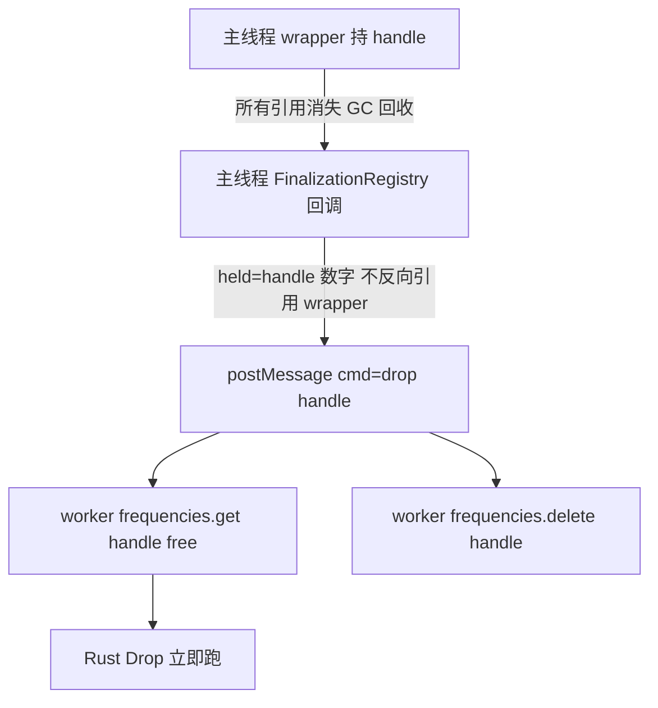

# 频率类设计（Frequency v1）

状态：**功能面设计已冻结**（grilling 全部走完）；**内存管理待 spike 验证后冻结**。
落地顺序：先一次性 spike 验证内存机制（见「内存管理」节，throwaway 不进主代码）
→ 宪法 change `governance-api-rules`（铁律九/十/十一 + 文档引用，**不含**铁律八
内存扩展）→ 实现 change `frequency-class`（引用铁律编号；铁律八内存扩展在 spike
通过后随本 change 或独立最高级变更补入）。浏览器壳（worker handle + async 访问器）
推迟到下一 change，本设计只定其契约。

参考实现：scikit-rf `skrf/frequency.py`（兼容基准）、RF-Touchstone
`src/frequency.ts`（波长能力来源，接口风格不采）、SignalIntegrity
`FrequencyDomain`（分层印证，GPL 只读思想）。

## 三条新铁律（change `governance-api-rules`，最高级变更先行）

### 铁律九 跨端协议钩子

每个公开类 MUST 在全部存在该对象的端提供统一显示串，格式
`ClassName(摘要)`（如 `Frequency(1.0-5.0 GHz, 3 pts)`），各端 MUST 使用同一
字符串内容。入口按语言原生协议命名，MUST NOT 自造跨语言同名方法（Python 不
写 `toString()`，JS 不写 `__str__`）：

- Rust：`impl Display`（`{}`）+ `#[derive(Debug)]`（`{:?}`），二者输出同一串；
- Python：`__str__` 与 `__repr__` 互等（对齐 skrf 惯例），`print(f)`、REPL、
  f-string 自动触发；
- Node：`toString()` + `util.inspect.custom` 钩子，`console.log(f)` 自动触发；
- 浏览器（worker 隔离，铁律八）：`async toString()`；`console.log(f)` 无标准
  美化机制（DevTools 无页面侧钩子），惯用法 `console.log(await f.toString())`。

跨端统一惯用法 `await x.toString()` MUST 在 node 与浏览器同时成立（node 同步
字符串经 `await` 原样透传）。浏览器端模板插值 `${x}` MUST NOT 使用（Promise
经 `ToPrimitive` 抛 TypeError），docs MUST 写明。

长度协议：凡暴露 `npoints` 的公开类 MUST 提供 Python `__len__` 一行委托
`npoints`（JS/Rust 无此协议，无对等义务；skrf `Frequency.__len__` 同源）。

协议保留名（netwave 内有特殊含义、不得挪作他用）：`__str__`、`__repr__`、
`Display`、`Debug`、`toString`、`inspect.custom`、`__len__`。`npoints` 本身
不是协议名，是铁律十从 skrf 继承的契约成员。

#### Scenario: print 自动触发

- **WHEN** 在 Rust/Python/Node 中 `println!("{f}")` / `print(f)` / `console.log(f)`
- **THEN** 输出统一显示串 `ClassName(摘要)`，无需显式调用转换方法

#### Scenario: 跨端 await toString 一致

- **WHEN** 同一段 `await x.toString()` 分别跑在 node 与浏览器
- **THEN** 两端返回同一显示串

### 铁律十 scikit-rf API 兼容优先

公开 API 的命名、参数、返回值与语义 MUST 默认对齐 scikit-rf 同名概念（如
`from_f`、`f`/`f_scaled`/`unit`/`npoints`/`copy`）。偏离 MUST 在对应 change
的 design.md 写明更强收获（能力增量或契约强化），否则一律兼容。语言机械映射
不算偏离：TS camelCase（`fScaled`）、Rust snake_case、worker 端 async 化
（铁律八所致）。

#### Scenario: 偏离须有立案收获

- **WHEN** 新公开 API 与 skrf 同名概念命名或语义不同
- **THEN** design.md 含"更强收获"论证，code-review Standards 轴据此判定；
  无论证即打回

### 铁律十一 绑定薄壳

绑定层（pyo3/napi/wasm-bindgen 壳与 TS/Python 再导出壳）MUST 是薄壳：只做
类型搬运与再导出，MUST NOT 含业务逻辑、数值计算、状态存储或适配转换代码。
新增能力 MUST 在 core 添加（含为某端类型便利添加的入参重载，如 enum|str
双收、数组|标量双收），绑定端 MUST NOT 为此改动壳代码。某端缺少所需能力时，
修复位置 MUST 是 core 绑定宏段，而非 JS/Python 壳。协议钩子对契约成员的一行
委托（如 py `__len__` 调 `npoints`）属名字搬运，不算壳逻辑。

#### Scenario: 壳内逻辑即打回

- **WHEN** code-review Standards 轴在 `typescript/src/` 或 `python/netwave/`
  壳中发现数值换算、状态持有或词汇表
- **THEN** 打回，要求下沉 core；能力缺失改 core 绑定段，壳保持零改动

### 教学式文档元规则补充（同 change，修订既有元规则）

代码内文档（rustdoc/docstring/JSDoc）引用权威书目 MUST 用「书名 + 可访问
链接」，引用格式唯一真相源为根 [README.md](../README.md) 的 References 节：

- P. J. Pupalaikis, _S-Parameters for Signal Integrity_, Cambridge
  University Press, 2020 — DOI `https://doi.org/10.1017/9781108784863`
- Touchstone® File Format Specification v2.1 (IBIS Open Forum) —
  `https://ibis.org/touchstone_ver2.1/touchstone_ver2_1.pdf`

MUST NOT 在代码内文档写本地绝对路径（外部读者不可访问）。

**本机镜像路径的归属（三条线分离，各只一处，禁跨层重复）**：

- **可移植公开引用**（书名/仓库 + URL）：唯一真相源为根 README References 节，
  跨机器通用、进发布文档。
- **本机 agent 查阅入口**（绝对路径 + 许可红线）：唯一落根 CONTRIBUTING.md
  新增小节「Local reference mirrors (this machine only)」（英文）。本机 agent
  直接离线读本地克隆（每书目录内 `SKILL.md` 给行号导航）；换机时路径不存在，
  先 `ls` 自检，缺失则按 README References 上游自行 clone 到任意路径并更新该表。
  不写机器名（本机 hostname 为容器哈希、必漂移），改以"路径存在性自检"表达
  机器限定。
- **契约指针**：治理 spec「教学式文档与类型标注」元规则**去掉内嵌绝对路径**，
  改为指针——权威术语源的本机镜像见 CONTRIBUTING 该表，可移植引用见 README
  References。

CONTRIBUTING 表只列 4 个真参考（两书 + scikit-rf + SignalIntegrity）。
**RF-Touchstone 不入此表、不入 README References**——它是 netwave 的**前身项目**
（predecessor，非外部参考），netwave 取代它、波长 API 源于此；仅在 CONTRIBUTING
单列一段「Predecessor project (not a reference)」标注 lineage，代码文档不引用它
（后续由 RF-Touchstone 反向指向 netwave）。

**但本机路径仍须列出**（供本机 agent 离线查 lineage/波长 API 出处）：该段写明
`/config/GitHub/RF-Touchstone/`（MIT，panz2018），同样带换机 `ls` 自检——它是
前身而非参考，故单列一段、不并入 4 参考表，也不进 README References。

## Frequency v1 API 面（定案）

```python
from netwave import Frequency, FrequencyUnit, WavelengthUnit
from netwave.constants import SPEED_OF_LIGHT

f = Frequency.from_f([1.0, 2.0, 5.0], unit="GHz")   # unit 必填；enum|str；数组|标量
f = Frequency.from_wavelength([60.0], WavelengthUnit.mm, n=2.2)  # n 必填
f.f            # ndarray[float64]，Hz 主数据（唯一存储，零拷贝视图）
f.f_scaled     # 当前 unit 派生（只读，property）
f.w            # 角频率 ω=2πf，rad/s
f.npoints      # 3；len(f) 同（协议钩子一行委托）
f.unit         # FrequencyUnit.GHz（getter 返回 enum）
f.unit = "MHz" # setter 收 enum|str，大小写不敏感，非法 ValueError 含原文
f.wavelength(WavelengthUnit.mm, n=2.2)  # λ=c/(n·f)；f=0 → inf
f.copy()
repr(f)        # 'Frequency(1.0-5.0 GHz, 3 pts)'；空轴 'Frequency([no freqs])'
```

TS 端机械 camelCase（`fromF`、`fromWavelength`、`fScaled`），`unit` setter
同样收 `FrequencyUnit | string`（union 搬运在 rust 绑定宏段，TS 壳零改动，
铁律十一）；`SPEED_OF_LIGHT` 命名导出。Node `console.log(f)` 经 inspect
钩子自动出显示串；浏览器 `await f.toString()`。

### 核心决策要点

- 存储：`f: Vec<f64>` 恒 Hz + `unit: FrequencyUnit` 元数据；派生值不落存储。
- `WavelengthUnit { m, cm, mm, um, nm }` 新 enum，照 `FrequencyUnit` 反射三端
  （零手抄），作用域限波长 API；不叫 `LengthUnit`（RF 语境 length=线长歧义）。
- `n` = 相折射率（phase index，n=c/v_p=√ε_eff），非群折射率；**必填**——
  介质上默认 n=1 物理必错，静默错比报错恶劣。docs 写公式与出处（铁律十
  偏离的更强收获：RF-Touchstone 忽略 n 的 property 形态物理残缺）。
- `from_wavelength` 为构造器而非 `set_wavelength` mutator：与 `from_f` 对称，
  且 api-contract 已禁单独频率轴 setter。
- f=0 → `wavelength()` 返回 inf（skrf/numpy 语义，DC 是合法频点）；负频率
  不校验（skrf 允许；拒绝规则整体归阶段 2）。
- `SPEED_OF_LIGHT: f64 = 299_792_458`（SI 精确值；下划线为 Rust 千位分隔符，
  编译期忽略）：core `pub mod constants`；Python 薄再导出子模块
  `netwave/constants.py`（镜像 skrf `constants` 命名空间）；TS 命名导出。
- `unit` getter 返回 enum 而非 skrf 的 str——铁律十偏离，收获=IDE 词汇校验
  - 零手抄（design.md 立案）。
- `from_f` 的 `unit` 必填（skrf 的 DeprecationWarning 是弃用过渡态，兼容
  终态不兼容过渡态）。
- 错误契约落地：字符串 unit 入参经 core `FromStr`（大小写不敏感），非法 →
  py `ValueError` / ts `TypeError`，含原文——frequency-unit spec 预留的
  「首个字符串入参入口」即此处。
- **内存管理见下方「内存管理（待 spike 验证后冻结）」节**——原「四端全自动回收 /
  worker 关闭即释放 / `FinalizationRegistry` 不适用」结论经 wasm-bindgen 0.2.128
  源码与双 realm 分析证伪，已废弃。

## 内存管理（待 spike 验证后冻结）

> 本节结论来自 wasm-bindgen **0.2.128**（`Cargo.lock` 锁定）源码与双 realm 分析，
> **未经实测**——spike 通过前不升宪法，验证闸门见本节末「spike 验证」。

### 源码实证（wasm-bindgen 0.2.128）

`wasm-bindgen-cli-support` 的 `js/mod.rs` 对每个 `#[wasm_bindgen]` class：

- 构造函数生成 `XFinalization.register(obj, ptr, obj)`（约 2282 行）；
- GC 回调生成 `(free_fn)(ptr, 1)`（约 2325 行）——回收 obj 时自动跑 Rust `Drop`；
- `typeof FinalizationRegistry === 'undefined'` 时降级 no-op（约 2352 行兜底）。

即 wasm-bindgen **确实**自动生成 `FinalizationRegistry`，默认工作；旧结论
「`FinalizationRegistry` 不适用」错误。

### 为什么本架构下它救不了（双 realm）

铁律八：主线程无 wasm，`Frequency` 真数据活在 worker realm。两个不同 JS 对象：

| 对象                              | 所在 realm | 自带 registry 管得到吗                                                        |
| --------------------------------- | ---------- | ----------------------------------------------------------------------------- |
| 主线程 `Frequency` 壳（用户持有） | 主线程     | 管得到，但它只是数字 handle，回收它不碰 worker 内存                           |
| worker 内 wasm 对象（真数据）     | worker     | registry 在 worker，但被 `frequencies` Map 强引用 → 永不变垃圾 → 回调永不触发 |

为「主线程按 handle 寻址」而故意用 Map 强引用住 worker 对象，恰好杀死了
wasm-bindgen 的自动回收；两 realm 的 GC 互不相通。故跨 realm 必须有一条显式
main→worker 的 drop 消息。

### 两层架构（spike 验证目标）



| 层                            | 角色                                    | 说明                                                                                   |
| ----------------------------- | --------------------------------------- | -------------------------------------------------------------------------------------- |
| 主线程 `FinalizationRegistry` | 生命周期驱动器（`__del__` 式自动）      | 壳被 GC 时回调 postMessage 通知 worker 释放；held 只存 handle 数字，不反向引用 wrapper |
| worker `frequencies` Map      | handle→对象地址表 + worker 侧唯一强引用 | **不可删**（跨边界只传数字 handle，worker 靠它路由消息）；被回调 `delete` 清除         |
| 显式 `drop()`                 | 确定性逃生口                            | GC 时机不可控（页面卸载前可能不跑）；大扫频跑完想立刻回收就手动调                      |

共享所有权天然安全：circuit 与 network 同持 `f` → wrapper 不被 GC → 回调不触发
→ worker 对象活着。这比「替换即删」式手动管理强，正是共享场景所需。

### 各端策略

| 端     | 自动回收                                                                 | 显式 `drop()`                             |
| ------ | ------------------------------------------------------------------------ | ----------------------------------------- |
| Rust   | RAII `Drop`                                                              | 无（不需要）                              |
| Python | pyo3 引用计数归零自动 drop 内层 Rust                                     | 无（加=footgun 且违铁律十，skrf 无 drop） |
| Node   | napi cleanup finalizer（壳 GC 自动 drop 内层 Rust，等价主线程 registry） | 可选                                      |
| 浏览器 | 主线程 `FinalizationRegistry` 驱动 worker 释放                           | 保留（逃生口）                            |

命名：`drop()`（用户拍板——「销毁即止，不必纠结释放给谁」），不用
`release`/`free`/`delete`。`Handle` 类型名保留。

### wasm 线性内存高水位 caveat

wasm32 线性内存只增不减（无 `memory.shrink`）：`Drop` 归还的 `Vec` 内存进 Rust
分配器 free list 供下个对象复用，**不**还给宿主。峰值 = 最大并发活对象，非累计
分配量。docs MUST 写明，避免用户误以为「不 drop 就无限涨」。

### spike 验证（冻结前置闸门）

用 `prototype` 技能写一次性 spike（throwaway，不进主代码、不进主构建），结构镜像
真实 worker handle 表使结论可迁移；真 `Frequency` 在实现 change 里另起。环境：真
浏览器（vitest browser mode / Chromium，复用 `vitest.browser.config.ts`），node 的
GC 策略不算数。可观测性：core 侧 `AtomicUsize` 活对象计数（`new` +1 / `Drop` −1）
经 wasm→worker→主线程暴露，配 worker `frequencies.size` 双证。GC 强制：Chromium
`--expose-gc` + `globalThis.gc()`（vitest browser mode 传 launch args），兜底轮询
超时防 flaky。

三条断言（全绿才冻结本节并升铁律八内存扩展）：

1. **registry 驱动 free**：丢弃主线程壳最后一个引用 → `gc()` → 活对象计数归零
   （证明回调 → postMessage → worker `free()` → Rust `Drop` 链路通）；
2. **共享不误删**：同 handle 两个 JS 引用，释放其一 → 计数不减；释放其二并
   `gc()` → 计数归零；
3. **显式 drop 即时**：调 `drop()` 后**不** `gc()`，计数立即减（确定性逃生口有效）。

spike 失败的回退：若浏览器 GC 时机不可靠到无法测出，则反转主辅——显式 `drop()`
为主、registry 仅兜底，并据此重写本节与铁律八扩展。

## 明确不做（v1 拒绝清单）

linspace/geomspace 扫频构造、`df`/`df_scaled`/`dw` 梯度、
`start`/`stop`/`center`/`step`/`span`（含 `_scaled`）、`t`/`t_ns` 时域、
`round_to`/`overlap`/单调检查、字符串切片 `__getitem__`、算术 dunder、
`multiplier`（不暴露）、`set_wavelength`、`f_Hz`/`f_kHz` 具名访问器族
（每单位名手抄进 glue=漂移面，且 skrf 无此物）。

## 实现清单

### change `governance-api-rules`（宪法，spike 无关部分先行）

- 新增铁律九/十/十一（上文草案）；
- **铁律八内存扩展（跨 realm 生命周期：主线程 registry 驱动 + worker 地址表 +
  `drop()` 逃生口）不在本 change**——待 spike 实测通过后随 `frequency-class` 或
  独立最高级变更补入（未验证的内存规则不进宪法）；
- 修订「教学式文档与类型标注」元规则：补引用格式（书名+可访问链接，
  禁本地路径）；**去掉该元规则内嵌的绝对路径**，改为指针（本机镜像见
  CONTRIBUTING「Local reference mirrors」表，可移植引用见 README References）；
- 根 CONTRIBUTING.md 新增「Local reference mirrors (this machine only)」小节
  （英文）：4 个真参考表（两书 + scikit-rf + SignalIntegrity，含许可红线）+
  换机 `ls` 自检指引；另单列「Predecessor project (not a reference)」段标注
  RF-Touchstone（前身项目，不入表、不入 README References）；
- 根 README References **不动**（RF-Touchstone 作为前身不加入）。

### change `frequency-class`（实现，core + Python + Node + 浏览器 wasm 全量）

- `core/src/frequency.rs`：`Frequency` struct（`from_f`/`from_wavelength`/
  `f`/`f_scaled`/`w`/`unit`/`set_unit`/`npoints`/`wavelength`/`Display`/
  `Debug`/`Clone`），`WavelengthUnit` enum（穷尽 `multiplier`，
  `FromStr` 大小写不敏感）；
- `core/src/constants.rs`：`SPEED_OF_LIGHT`；
- pyo3 绑定：`#[pyclass]` + `__len__`/`__str__`/`__repr__`；
  `python/netwave/constants.py` 薄再导出；
- napi 绑定：`toString` + inspect 钩子（生成物侧）；TS 壳仅 re-export；
- 浏览器 wasm（本变更内，非后续）：core `Frequency` 加
  `#[cfg(all(feature = "browser", not(feature = "node"), not(coverage)))]` +
  `#[wasm_bindgen]`（照 `FrequencyUnit` 同款，LL-044 feature 门控）；常驻 worker
  侧 Frequency 消息协议（构造/访问器动词走 worker JSON+buffer，铁律八主线程零
  wasm）；浏览器 TS 壳全 async 访问器 + `async toString()`；
- 浏览器内存管理（spike 通过后）：主线程 `FinalizationRegistry` 驱动 worker 释放
  （壳被 GC → `postMessage {cmd:"drop", handle}` → worker `free()` +
  `frequencies.delete(handle)` → Rust `Drop`）；worker `frequencies` Map 作
  handle→对象地址表（被回调清除，不可删）；显式 `drop()` 作确定性逃生口；core 侧
  `AtomicUsize` 活对象计数（`new` +1 / `Drop` −1）经 worker 暴露供绊线测试轮询归零；
- node 内存管理：napi cleanup finalizer 等价主线程 registry（壳 GC 自动 drop 内层
  Rust），`drop()` 可选；Python/Rust 不加 `drop()`（引用计数/RAII 全自动，加=
  footgun 且违铁律十）；
- `.pyi` / `.d.mts` 重新生成（stub_gen + napi dts）；
- `scripts/check_vocab_types.py` 纳入 `WavelengthUnit` 三端成员集合一致；
- 绊线测试：三端成员集合、错误含原文、显示串逐字符、λ↔f 往返对拍
  （容差引用 manifest，铁律三；精确常量逐 bit，LL-042）；
- 新增 `test:*` 脚本当轮接进 CI（LL-037）。

### 后续（不在本设计范围）

- `Plan/总体计划.md` 待决清单「Frequency/单位显示形态」条目在实现合入后
  划除（结论吸收进本设计与 spec）。
